Sal Lempert
Psych 254
3.10.15
========================================================

Replication project analysis script


```r
#source("../helper/useful.R")
library(dplyr)
```

```
## 
## Attaching package: 'dplyr'
## 
## The following object is masked from 'package:stats':
## 
##     filter
## 
## The following objects are masked from 'package:base':
## 
##     intersect, setdiff, setequal, union
```

```r
library(ggplot2)
library(MASS)
```

```
## 
## Attaching package: 'MASS'
## 
## The following object is masked from 'package:dplyr':
## 
##     select
```

```r
#setwd("~/Documents/Psych254/replication_project")
#d <- read.csv("254_rep_proj_practice_set_forR.csv")
d <- read.csv("../254_rep_proj_fullx.csv")
```


Clean data:
re-format?? 
exclude participants who scored >3 on suspicion and guessed purpose of manipulation
also exclude participants who failed both article comprehension/attention checks


```r
# assign condition variable
count = 1;
for (i in d$Headache){
  if(is.na(i)){
    d$cond[count] = 1
    }
  else{
    d$cond[count] = 0
    }
  count = count +1;
}

d.0 = subset(d, cond==0)
d.1 = subset(d, cond==1)
d.tidy0 =  dplyr::select(d.0, head_time_3, head_check, nuc_time_3, nuc_check, 53:105)
d.tidy1 =  dplyr::select(d.1, scan_time_3, scan_check, tms_time_3, tms_check, 53:105)
d.tidy0 = rename(d.tidy0, read1_time = head_time_3, read1_check = head_check, read2_time = nuc_time_3, read2_check = nuc_check)
d.tidy1 = rename(d.tidy1, read1_time = scan_time_3, read1_check = scan_check, read2_time = tms_time_3, read2_check = tms_check)

d.tidy = merge(d.tidy0, d.tidy1, all = TRUE)
d.tidy = rename(d.tidy, blame = blame_1)
d.tidy = rename(d.tidy, income = Q26)
d.tidy["exclude"] = 0;
d.tidy$cond = factor(d.tidy$cond)

#exclusions
d.tidy$exclude[8] = 1; #failed both comprehension checks, condition =0
d.tidy$exclude[60] = 1; #suspicion, condition =1
d.tidy$exclude[45] = 1; #suspicion, condition = 1
#questionable cases: 65, 63, 62

#cut the excluded participants from sample
d.tidy = subset(d.tidy, exclude ==0);


# create new column for the mean scores on FAD
d.tidy["fad"] = apply(d.tidy[7:13], 1, FUN = "mean")

# PANAS
#positive: 1, 3, 5, 9, 10, 12, 14, 16, 17, 19
#negative: 2, 4, 6, 7, 8, 11, 13, 15, 18, 20
#create new columns for the mean scores on positive and negative items on PANAS
#d.tidy["panas_pos"] = apply(d.tidy['panas_1', 'panas_3', 'panas_5','panas_9','panas_10','panas_12','panas_14','panas_16','panas_17','panas_19'], 1, FUN = "mean")

#d.tidy["panas_pos"] = apply(d.tidy[1, 3, 5, 9, 10, 12, 14, 16, 17, 19], 1, FUN = "mean")

d.tidy["panas_pos"] = apply(subset(d.tidy, select = c('panas_1', 'panas_3', 'panas_5','panas_9','panas_10','panas_12','panas_14','panas_16','panas_17','panas_19')), 1, FUN = "mean")

d.tidy["panas_neg"] = apply(subset(d.tidy, select = c('panas_2', 'panas_4', 'panas_6','panas_7','panas_7','panas_11','panas_13','panas_15','panas_18','panas_20')), 1, FUN = "mean")


# i can't figure out how to automate a function to exclude based on the comprehension check (they have to have the correct answer on at least one), so i will do this manually, as I believe most people will get the questions right it will be easy to spot the ones who didn't

# for (row in d.tidy)
#   {
#   if(is.na(row['read1_check'])){
#     if(is.na(row['read2 _check'])){
#       row['exclude'] = 1;
#     }
#     else if (row['read2_check'] ==2){
#       row['exclude'] = 0;
#     }
#     else{
#       row['exclude'] = 1;
#     }
#   }
#   else if(is.na(row['read2_check'])){
#     if (row['read2_check'] ==2){
#       row['exclude'] = 0;
#     }
#     else{
#       row['exclude'] = 1;
#     }
#   }
#   else if(row['read1_check'] == 2 || row['read2_check'] ==2){
#     row['exclude'] = 0;
#   }
#   else{
#     row['exclude'] = 1;
#   }
#   }
#for (row in d.tidy){
#  print(row['read1_check'])
#  if ((is.na(row['read1_check']) || row['read1_check']!=2) && (is.na(row['read2_check']) || row['read#2_check']!=2))
#    {
#    row['exclude'] = 1;
#  }
#  else{ 
#    row['exclude'] = 0;
#    }
#}

#ummm well this part isn't working yet, trying to automate exclusion based on failing both article comprehension checks, but it's bugging out
```

demographics

```r
d.tidy$gender = factor(d.tidy$gender)
summary(d.tidy$gender) #wow, exactly even?? how'd that happen
```

```
##  1  2 
## 32 32
```

```r
summary(d.tidy$age)
```

```
##    Min. 1st Qu.  Median    Mean 3rd Qu.    Max. 
##   21.00   26.75   32.00   37.73   47.00   69.00
```

```r
summary(d.tidy$education_1)
```

```
##    Min. 1st Qu.  Median    Mean 3rd Qu.    Max.    NA's 
##   1.000   5.000   6.000   5.794   7.000   9.000       1
```

```r
summary(d.tidy$politics_1) #general
```

```
##    Min. 1st Qu.  Median    Mean 3rd Qu.    Max. 
##   1.000   2.000   3.000   3.406   4.250   7.000
```

```r
summary(d.tidy$politics_2) #social
```

```
##    Min. 1st Qu.  Median    Mean 3rd Qu.    Max. 
##   1.000   1.000   3.000   2.984   4.000   7.000
```

```r
summary(d.tidy$politics_3) #economic
```

```
##    Min. 1st Qu.  Median    Mean 3rd Qu.    Max. 
##   1.000   2.000   4.000   3.703   5.000   7.000
```

```r
summary(d.tidy$relig_1)
```

```
##    Min. 1st Qu.  Median    Mean 3rd Qu.    Max. 
##   1.000   1.000   1.000   1.672   2.000   5.000
```


free will beliefs

```r
#plot this shit
qplot(fad, data = d.tidy)
```

```
## stat_bin: binwidth defaulted to range/30. Use 'binwidth = x' to adjust this.
```

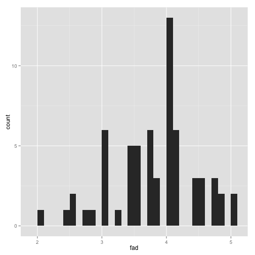 

```r
qplot(cond, fad, data = d.tidy, geom = "boxplot")
```

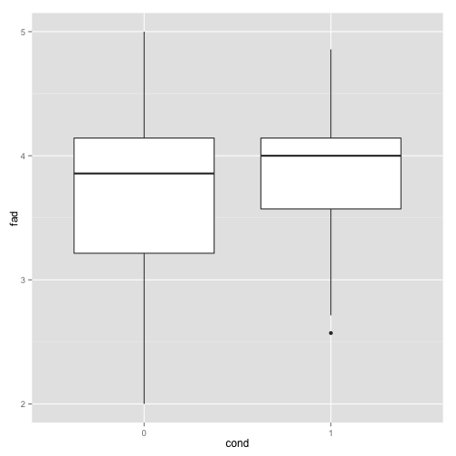 

```r
#test difference
#t.test(fad~cond, d.tidy)

freewill_cond = with(d.tidy, lm(fad~cond))
summary(freewill_cond)
```

```
## 
## Call:
## lm(formula = fad ~ cond)
## 
## Residuals:
##     Min      1Q  Median      3Q     Max 
## -1.7558 -0.3272  0.1329  0.3074  1.2442 
## 
## Coefficients:
##             Estimate Std. Error t value Pr(>|t|)    
## (Intercept)  3.75576    0.11860  31.668   <2e-16 ***
## cond1        0.07974    0.16516   0.483    0.631    
## ---
## Signif. codes:  0 '***' 0.001 '**' 0.01 '*' 0.05 '.' 0.1 ' ' 1
## 
## Residual standard error: 0.6603 on 62 degrees of freedom
## Multiple R-squared:  0.003745,	Adjusted R-squared:  -0.01232 
## F-statistic: 0.2331 on 1 and 62 DF,  p-value: 0.6309
```

```r
#free will beliefs did not differ by condition (bummmmer)
```

Punishment

```r
#plot this shit
qplot(sentence, data=d.tidy)
```

```
## stat_bin: binwidth defaulted to range/30. Use 'binwidth = x' to adjust this.
```

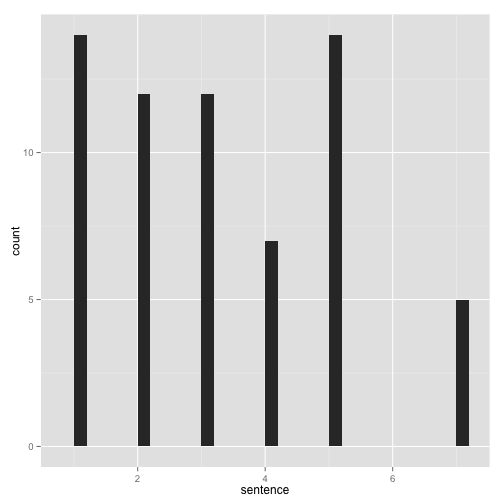 

```r
qplot(sentence, fill = cond, position = "dodge", data=d.tidy) #not exactly normal...
```

```
## stat_bin: binwidth defaulted to range/30. Use 'binwidth = x' to adjust this.
```

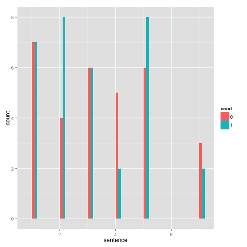 

```r
qplot(cond, sentence, data=d.tidy, geom = "boxplot")
```

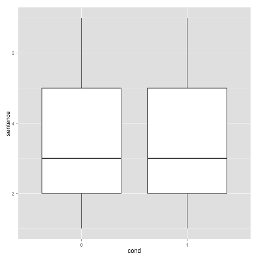 

```r
#test this shit
#t.test(sentence~cond, d.tidy)

sentence_cond = with(d.tidy, lm(sentence~cond))
summary(sentence_cond)
```

```
## 
## Call:
## lm(formula = sentence ~ cond)
## 
## Residuals:
##    Min     1Q Median     3Q    Max 
## -2.355 -1.355 -0.238  1.645  3.879 
## 
## Coefficients:
##             Estimate Std. Error t value Pr(>|t|)    
## (Intercept)   3.3548     0.3279  10.232  6.1e-15 ***
## cond1        -0.2336     0.4566  -0.512    0.611    
## ---
## Signif. codes:  0 '***' 0.001 '**' 0.01 '*' 0.05 '.' 0.1 ' ' 1
## 
## Residual standard error: 1.826 on 62 degrees of freedom
## Multiple R-squared:  0.004205,	Adjusted R-squared:  -0.01186 
## F-statistic: 0.2618 on 1 and 62 DF,  p-value: 0.6107
```

```r
sentence_cond_mood = with(d.tidy, lm(sentence~cond + panas_pos + panas_neg))
summary(sentence_cond_mood)
```

```
## 
## Call:
## lm(formula = sentence ~ cond + panas_pos + panas_neg)
## 
## Residuals:
##     Min      1Q  Median      3Q     Max 
## -2.2688 -1.3625 -0.1719  1.5013  3.9318 
## 
## Coefficients:
##             Estimate Std. Error t value Pr(>|t|)  
## (Intercept)  2.83574    1.09073   2.600   0.0117 *
## cond1       -0.16161    0.47043  -0.344   0.7324  
## panas_pos   -0.06098    0.28014  -0.218   0.8284  
## panas_neg    0.51605    0.50277   1.026   0.3088  
## ---
## Signif. codes:  0 '***' 0.001 '**' 0.01 '*' 0.05 '.' 0.1 ' ' 1
## 
## Residual standard error: 1.839 on 60 degrees of freedom
## Multiple R-squared:  0.022,	Adjusted R-squared:  -0.0269 
## F-statistic: 0.4499 on 3 and 60 DF,  p-value: 0.7183
```

```r
m0 = mean(subset(d.tidy, cond==0)$sentence)
sd0 = sd(subset(d.tidy, cond==0)$sentence)
m1 = mean(subset(d.tidy, cond==1)$sentence)
sd1 = sd(subset(d.tidy, cond==1)$sentence)
#welll, that didn't work, no sig difference by condition
#Cohen's d = 2t /√(df)
samp_t = summary(sentence_cond)$coefficients[6] # this is the t value
samp_df = summary(sentence_cond)$df[2] #this is the df for the model
coh_d = 2*samp_t/sqrt(samp_df)
coh_d
```

```
## [1] -0.1299638
```

```r
#Cohen's d = M1 - M2 / spooled 
  #  where spooled =√[(s 12+ s 22) / 2]
coh_d2 = (m1-m0)/sqrt((sd0^2+sd1^2)/2)
coh_d2
```

```
## [1] -0.1278771
```

```r
#aaaand some kind of non-parametric test also?  in the original paper they reported results from a t-test, but the scale is not continuous, so this seems inappropriate. for now, not gonna worry bout it.
```


```r
d.tidy$sent_fact = as.factor(d.tidy$sentence)
ord_sent = polr(sent_fact ~ cond, data = d.tidy)

summary(ord_sent)
```

```
## 
## Re-fitting to get Hessian
```

```
## Call:
## polr(formula = sent_fact ~ cond, data = d.tidy)
## 
## Coefficients:
##         Value Std. Error t value
## cond1 -0.2017     0.4426 -0.4558
## 
## Intercepts:
##     Value   Std. Error t value
## 1|2 -1.3829  0.3882    -3.5625
## 2|3 -0.4865  0.3469    -1.4026
## 3|4  0.2779  0.3379     0.8227
## 4|5  0.7616  0.3507     2.1716
## 5|7  2.3672  0.5144     4.6022
## 
## Residual Deviance: 221.7292 
## AIC: 233.7292
```

```r
#well, still not significant (i think??), soo.
```


```r
orig_0 = cbind(3.83, 1.77, 1.77/sqrt(44), 1.96*1.77/sqrt(44)) # mean, sd, estimated se, 95% conf int for control condition in original study
orig_1 = cbind(3.1, 1.38, 1.38/sqrt(44), 1.96*1.38/sqrt(44)) #mean, sd, estimated se, 95% conf int for manipulation condition in orig study
#df for t-test in original study = 86.  n=88
# se = sd/sqrt(n)   but how many in each condition?
orig = rbind(orig_0, orig_1)
orig = as.data.frame(orig)
colnames(orig) = c("mean", "sd", "se", "ci95")
orig['cond'] = c(0,1)

# when i have my own data, will add after y=mean, fill=**whatever i call that variable that has whether its mine or theirs**
ggplot(orig, aes(x=cond, y=mean, fill = "Original")) +
  geom_bar(position=position_dodge(), stat="identity") +
  geom_errorbar(aes(ymin = mean-ci95, ymax = mean+ci95), width = .2, position=position_dodge(.9))
```

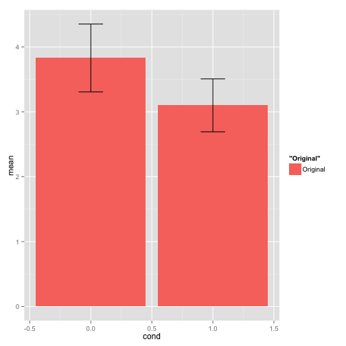 

```r
sent_mean_0 = with(subset(d.tidy, cond==0), mean(sentence))
sent_sd_0 = with(subset(d.tidy, cond==0), sd(sentence))
cond_count = count(d.tidy, groupby = cond)
sent_n_0 = cond_count[2]$n[1]
sent_n_1 = cond_count[2]$n[2]
sent_mean_1 = with(subset(d.tidy, cond==1), mean(sentence))
sent_sd_1 = with(subset(d.tidy, cond==1), sd(sentence))
rep_0 = cbind(sent_mean_0, sent_sd_0, sent_sd_0/sqrt(sent_n_0), 1.96*sent_sd_0/sqrt(sent_n_0)) 
rep_1 = cbind(sent_mean_1, sent_sd_1, sent_sd_1/sqrt(sent_n_1), 1.96*sent_sd_1/sqrt(sent_n_1))
rep = rbind(rep_0, rep_1)
rep = as.data.frame(rep)
colnames(rep) = c("mean", "sd", "se", "ci95")
rep['cond'] = c(0,1)

ggplot(rep, aes(x=cond, y=mean, fill = "Replication")) +
  geom_bar(position=position_dodge(), stat="identity") +
  geom_errorbar(aes(ymin = mean-ci95, ymax = mean+ci95), width = .2, position=position_dodge(.9)) 
```

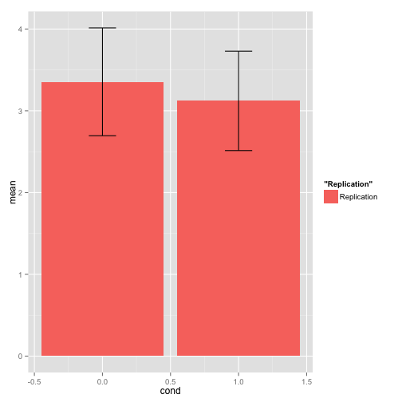 

```r
both = rbind(orig_0, orig_1, rep_0, rep_1)
both = as.data.frame(both)
colnames(both) = c("mean", "sd", "se", "ci95")
both['cond'] = c(0,1,0,1)
both$cond = factor(both$cond)
levels(both$cond) = c("Control", "Neuroscience")
both['study'] = c("Original","Original","Replication","Replication")

ggplot(both, aes(x=cond, y=mean, fill = study)) +
  geom_bar(position=position_dodge(), stat="identity") +
  geom_errorbar(aes(ymin = mean-ci95, ymax = mean+ci95), width = .2, position=position_dodge(.9)) + ylab("Mean sentence recommendation") + xlab("Article Condition") + ggtitle("Sentence recommendations\nOriginal vs Replication\n(Error bars represent 95% confidence intervals")
```

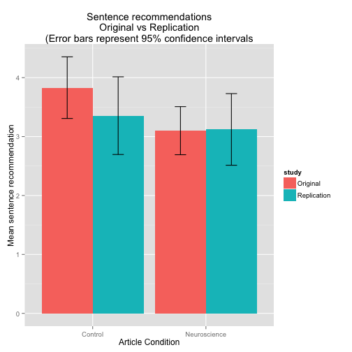 

```r
#ok, so the error bars are SD because i can't figure out how to appropriately calculate the SE, don't I need the N for each condition group, not the overall N?
```


```r
#plot this shit
qplot(blame, data = d.tidy) #wow super non-normal
```

```
## stat_bin: binwidth defaulted to range/30. Use 'binwidth = x' to adjust this.
```

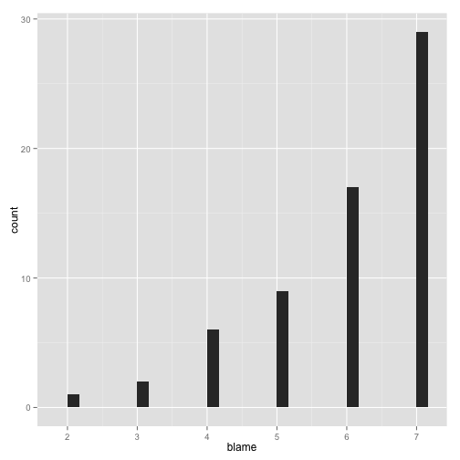 

```r
qplot(cond, blame, data = d.tidy, geom = "boxplot")
```

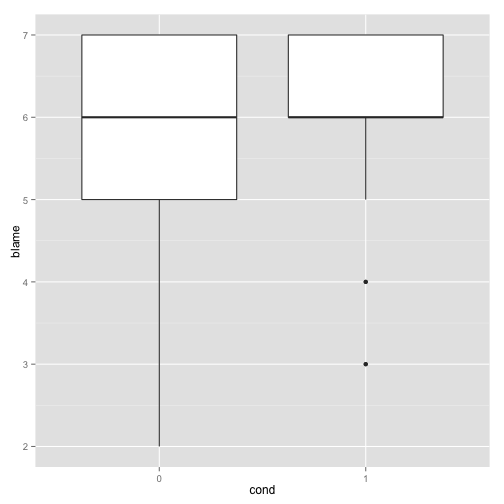 

```r
qplot(blame, , fill = cond, position = "dodge", data = d.tidy, geom = "bar", binwidth = 0.5)
```

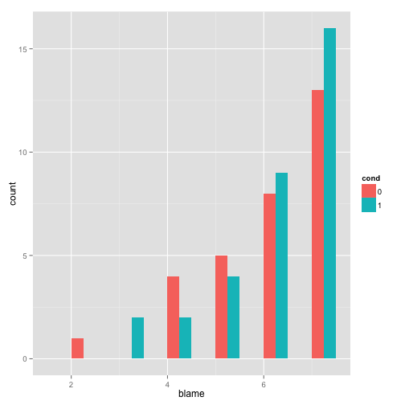 

```r
#try a transformation? square root? reverse square root?  original authors just went ahead with the standard t test, which seems ermmm inadvisable
#SQRT( (total + 1) - each persons' score) = their reverse square root
#d.tidy$blame_r = 8-d.tidy$blame
#d.tidy$blame_r_sqrt = sqrt(d.tidy$blame_r)
#qplot(blame_r_sqrt, data = d.tidy) #well that didn't help in the slightest

#test diff
blame_cond = with(d.tidy, lm(blame~cond))
summary(blame_cond)
```

```
## 
## Call:
## lm(formula = blame ~ cond)
## 
## Residuals:
##     Min      1Q  Median      3Q     Max 
## -3.8710 -0.8710  0.1290  0.9394  1.1290 
## 
## Coefficients:
##             Estimate Std. Error t value Pr(>|t|)    
## (Intercept)   5.8710     0.2227  26.357   <2e-16 ***
## cond1         0.1896     0.3102   0.611    0.543    
## ---
## Signif. codes:  0 '***' 0.001 '**' 0.01 '*' 0.05 '.' 0.1 ' ' 1
## 
## Residual standard error: 1.24 on 62 degrees of freedom
## Multiple R-squared:  0.005992,	Adjusted R-squared:  -0.01004 
## F-statistic: 0.3737 on 1 and 62 DF,  p-value: 0.5432
```

```r
blame_cond_mood = with(d.tidy, lm(blame~cond + panas_pos + panas_neg))
summary(blame_cond_mood)
```

```
## 
## Call:
## lm(formula = blame ~ cond + panas_pos + panas_neg)
## 
## Residuals:
##     Min      1Q  Median      3Q     Max 
## -3.2742 -0.8424  0.3786  0.7938  2.0277 
## 
## Coefficients:
##             Estimate Std. Error t value Pr(>|t|)    
## (Intercept)  7.72907    0.70408  10.978 5.56e-16 ***
## cond1        0.01921    0.30367   0.063   0.9498    
## panas_pos   -0.37463    0.18084  -2.072   0.0426 *  
## panas_neg   -0.58175    0.32454  -1.793   0.0781 .  
## ---
## Signif. codes:  0 '***' 0.001 '**' 0.01 '*' 0.05 '.' 0.1 ' ' 1
## 
## Residual standard error: 1.187 on 60 degrees of freedom
## Multiple R-squared:  0.1187,	Adjusted R-squared:  0.07459 
## F-statistic: 2.693 on 3 and 60 DF,  p-value: 0.05405
```

```r
mb0 = mean(subset(d.tidy, cond==0)$blame)
sdb0 = sd(subset(d.tidy, cond==0)$blame)
mb1 = mean(subset(d.tidy, cond==1)$blame)
sdb1 = sd(subset(d.tidy, cond==1)$blame)
mb0
```

```
## [1] 5.870968
```

```r
sdb0
```

```
## [1] 1.284314
```

```r
mb1
```

```
## [1] 6.060606
```

```r
sdb1
```

```
## [1] 1.197377
```

```r
bcoh_d2 = (mb1-mb0)/sqrt((sdb0^2+sdb1^2)/2)
bcoh_d2
```

```
## [1] 0.1527362
```

```r
#blame beliefs did not differ by condition (bummmmer)

with(d.tidy, cor.test(blame, sentence))
```

```
## 
## 	Pearson's product-moment correlation
## 
## data:  blame and sentence
## t = 3.5118, df = 62, p-value = 0.0008362
## alternative hypothesis: true correlation is not equal to 0
## 95 percent confidence interval:
##  0.1794908 0.5936941
## sample estimates:
##       cor 
## 0.4073286
```

```r
#non-parametric stats
wilcox.test(blame~cond, data = d.tidy)
```

```
## Warning in wilcox.test.default(x = c(4L, 7L, 7L, 7L, 6L, 7L, 5L, 7L, 6L, :
## cannot compute exact p-value with ties
```

```
## 
## 	Wilcoxon rank sum test with continuity correction
## 
## data:  blame by cond
## W = 467, p-value = 0.5298
## alternative hypothesis: true location shift is not equal to 0
```

Mediation by blameworthiness (bootstrap)

```r
mediation_bootstrap = function(x, med, y, iterations = 1000){
  
  # setup some parameters
  N = length(x)
  df = as.data.frame(cbind(x, med, y))
  boot_ab = vector(length=iterations) # set up empty vector for storage
  
  # now go through a loop where we'll randomly sample, and get a a*b value
  for (i in 1:iterations){
    ind_boot = sample(c(1:N), N, replace=TRUE) # random indices
    df_boot = df[ind_boot,]
      
    iter_a = lm(df_boot$med ~ df_boot$x)$coefficients[2] # coeff of x
    iter_b = lm(df_boot$y ~ df_boot$med + df_boot$x)$coefficients[2] # coeff of mediator
    
    boot_ab[i] = iter_a * iter_b
  }
  
  # create plot
  hist(boot_ab,main=paste("Bootstrapped a*b, with",iterations,"iterations"),col="red");
  abline(v=0, col='black', lty=2, lwd=2)
  abline(v=c(quantile(boot_ab,c(.025,.975))), col='blue', lty=3)
  
  # Print results
  print("Bootstrap results:",quote=F);
  print(c(ab=mean(boot_ab)));
  print(quantile(boot_ab,c(.025,.975)))
  
  return(boot_ab)
}
```


```r
boot_ab = mediation_bootstrap(x=d$cond, med=d$blame, y=d$sentence, iterations=10000)
```

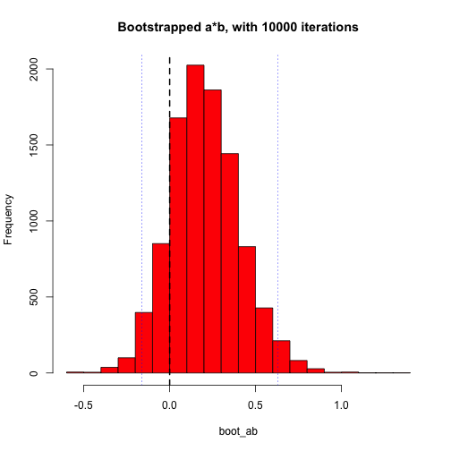 

```
## [1] Bootstrap results:
##        ab 
## 0.2056466 
##       2.5%      97.5% 
## -0.1620639  0.6292164
```

```r
cond_blame_sent = with(d.tidy, lm(sentence~cond + blame))
summary(cond_blame_sent)
```

```
## 
## Call:
## lm(formula = sentence ~ cond + blame)
## 
## Residuals:
##     Min      1Q  Median      3Q     Max 
## -3.0436 -1.2134 -0.1488  1.2088  3.3057 
## 
## Coefficients:
##             Estimate Std. Error t value Pr(>|t|)    
## (Intercept)  -0.2268     1.0509  -0.216 0.829853    
## cond1        -0.3493     0.4202  -0.831 0.409026    
## blame         0.6101     0.1715   3.557 0.000733 ***
## ---
## Signif. codes:  0 '***' 0.001 '**' 0.01 '*' 0.05 '.' 0.1 ' ' 1
## 
## Residual standard error: 1.675 on 61 degrees of freedom
## Multiple R-squared:  0.1753,	Adjusted R-squared:  0.1482 
## F-statistic: 6.481 on 2 and 61 DF,  p-value: 0.002803
```

```r
summary(sentence_cond)
```

```
## 
## Call:
## lm(formula = sentence ~ cond)
## 
## Residuals:
##    Min     1Q Median     3Q    Max 
## -2.355 -1.355 -0.238  1.645  3.879 
## 
## Coefficients:
##             Estimate Std. Error t value Pr(>|t|)    
## (Intercept)   3.3548     0.3279  10.232  6.1e-15 ***
## cond1        -0.2336     0.4566  -0.512    0.611    
## ---
## Signif. codes:  0 '***' 0.001 '**' 0.01 '*' 0.05 '.' 0.1 ' ' 1
## 
## Residual standard error: 1.826 on 62 degrees of freedom
## Multiple R-squared:  0.004205,	Adjusted R-squared:  -0.01186 
## F-statistic: 0.2618 on 1 and 62 DF,  p-value: 0.6107
```

```r
summary(blame_cond)
```

```
## 
## Call:
## lm(formula = blame ~ cond)
## 
## Residuals:
##     Min      1Q  Median      3Q     Max 
## -3.8710 -0.8710  0.1290  0.9394  1.1290 
## 
## Coefficients:
##             Estimate Std. Error t value Pr(>|t|)    
## (Intercept)   5.8710     0.2227  26.357   <2e-16 ***
## cond1         0.1896     0.3102   0.611    0.543    
## ---
## Signif. codes:  0 '***' 0.001 '**' 0.01 '*' 0.05 '.' 0.1 ' ' 1
## 
## Residual standard error: 1.24 on 62 degrees of freedom
## Multiple R-squared:  0.005992,	Adjusted R-squared:  -0.01004 
## F-statistic: 0.3737 on 1 and 62 DF,  p-value: 0.5432
```

```r
fad_sent = with(d.tidy, lm(sentence~fad))
summary(fad_sent) #ns. booo.
```

```
## 
## Call:
## lm(formula = sentence ~ fad)
## 
## Residuals:
##     Min      1Q  Median      3Q     Max 
## -2.6102 -1.3424 -0.2532  1.5349  3.7022 
## 
## Coefficients:
##             Estimate Std. Error t value Pr(>|t|)
## (Intercept)   2.0484     1.3442   1.524    0.133
## fad           0.3123     0.3489   0.895    0.374
## 
## Residual standard error: 1.818 on 62 degrees of freedom
## Multiple R-squared:  0.01276,	Adjusted R-squared:  -0.003164 
## F-statistic: 0.8013 on 1 and 62 DF,  p-value: 0.3742
```

```r
fad_blame = with(d.tidy, lm(blame~fad))
summary(fad_blame)  #marginal. this is ridiculous.
```

```
## 
## Call:
## lm(formula = blame ~ fad)
## 
## Residuals:
##     Min      1Q  Median      3Q     Max 
## -4.4448 -0.6534  0.1487  0.9509  1.4031 
## 
## Coefficients:
##             Estimate Std. Error t value Pr(>|t|)    
## (Intercept)   4.4664     0.8993   4.966 5.65e-06 ***
## fad           0.3957     0.2335   1.695   0.0951 .  
## ---
## Signif. codes:  0 '***' 0.001 '**' 0.01 '*' 0.05 '.' 0.1 ' ' 1
## 
## Residual standard error: 1.216 on 62 degrees of freedom
## Multiple R-squared:  0.04428,	Adjusted R-squared:  0.02887 
## F-statistic: 2.873 on 1 and 62 DF,  p-value: 0.09512
```

```r
fad_blame_sent = with(d.tidy, lm(sentence~fad + blame))
summary(fad_blame_sent)
```

```
## 
## Call:
## lm(formula = sentence ~ fad + blame)
## 
## Residuals:
##     Min      1Q  Median      3Q     Max 
## -2.8928 -1.2688 -0.2069  1.1494  3.1410 
## 
## Coefficients:
##             Estimate Std. Error t value Pr(>|t|)   
## (Intercept) -0.58765    1.47202  -0.399  0.69113   
## fad          0.07882    0.33060   0.238  0.81237   
## blame        0.59020    0.17582   3.357  0.00136 **
## ---
## Signif. codes:  0 '***' 0.001 '**' 0.01 '*' 0.05 '.' 0.1 ' ' 1
## 
## Residual standard error: 1.684 on 61 degrees of freedom
## Multiple R-squared:  0.1667,	Adjusted R-squared:  0.1394 
## F-statistic: 6.101 on 2 and 61 DF,  p-value: 0.003842
```

```r
#the mediation is not significant
```


Mood

```r
posmood_cond = with(d.tidy, lm(panas_pos~cond))
summary(posmood_cond)
```

```
## 
## Call:
## lm(formula = panas_pos ~ cond)
## 
## Residuals:
##      Min       1Q   Median       3Q      Max 
## -1.36970 -0.56970 -0.07033  0.52935  2.12903 
## 
## Coefficients:
##             Estimate Std. Error t value Pr(>|t|)    
## (Intercept)   2.8710     0.1498  19.169   <2e-16 ***
## cond1        -0.2013     0.2086  -0.965    0.338    
## ---
## Signif. codes:  0 '***' 0.001 '**' 0.01 '*' 0.05 '.' 0.1 ' ' 1
## 
## Residual standard error: 0.8339 on 62 degrees of freedom
## Multiple R-squared:  0.0148,	Adjusted R-squared:  -0.001094 
## F-statistic: 0.9312 on 1 and 62 DF,  p-value: 0.3383
```

```r
negmood_cond = with(d.tidy, lm(panas_neg~cond))
summary(negmood_cond)
```

```
## 
## Call:
## lm(formula = panas_neg ~ cond)
## 
## Residuals:
##      Min       1Q   Median       3Q      Max 
## -0.34516 -0.24516 -0.18182  0.01818  1.81818 
## 
## Coefficients:
##             Estimate Std. Error t value Pr(>|t|)    
## (Intercept)  1.34516    0.08345  16.119   <2e-16 ***
## cond1       -0.16334    0.11622  -1.405    0.165    
## ---
## Signif. codes:  0 '***' 0.001 '**' 0.01 '*' 0.05 '.' 0.1 ' ' 1
## 
## Residual standard error: 0.4647 on 62 degrees of freedom
## Multiple R-squared:  0.03088,	Adjusted R-squared:  0.01525 
## F-statistic: 1.975 on 1 and 62 DF,  p-value: 0.1649
```

```r
# no significant mood differences by condition

posmood_blame = with(d.tidy, cor.test(panas_pos,blame))
posmood_blame #significant
```

```
## 
## 	Pearson's product-moment correlation
## 
## data:  panas_pos and blame
## t = -2.1498, df = 62, p-value = 0.03548
## alternative hypothesis: true correlation is not equal to 0
## 95 percent confidence interval:
##  -0.47822876 -0.01878774
## sample estimates:
##        cor 
## -0.2633807
```

```r
negmood_blame = with(d.tidy, cor.test(panas_neg,blame))
negmood_blame #marginal
```

```
## 
## 	Pearson's product-moment correlation
## 
## data:  panas_neg and blame
## t = -1.8857, df = 62, p-value = 0.06402
## alternative hypothesis: true correlation is not equal to 0
## 95 percent confidence interval:
##  -0.45278875  0.01369182
## sample estimates:
##        cor 
## -0.2329013
```
